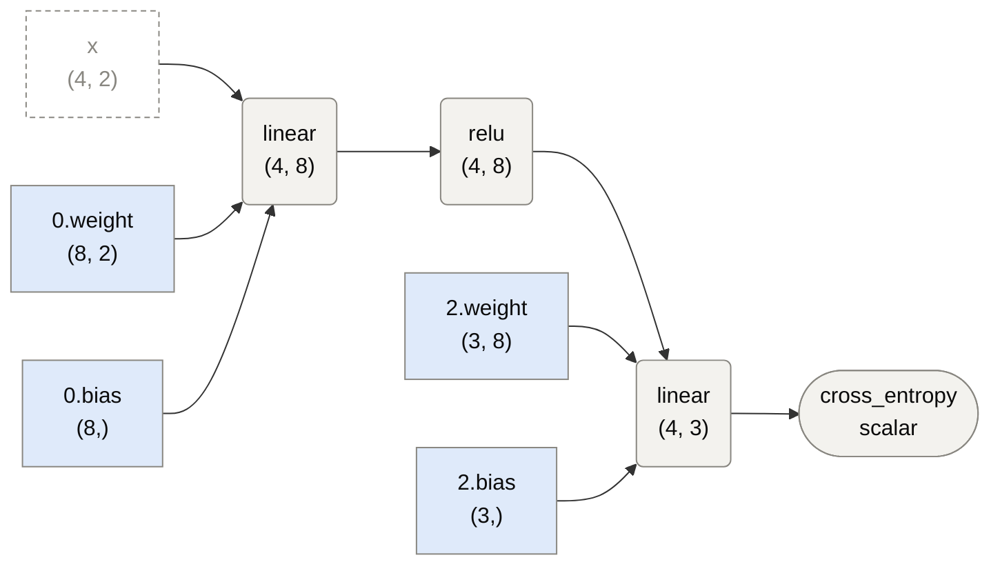
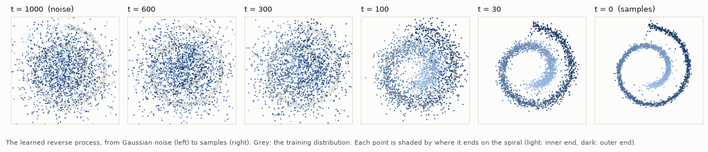
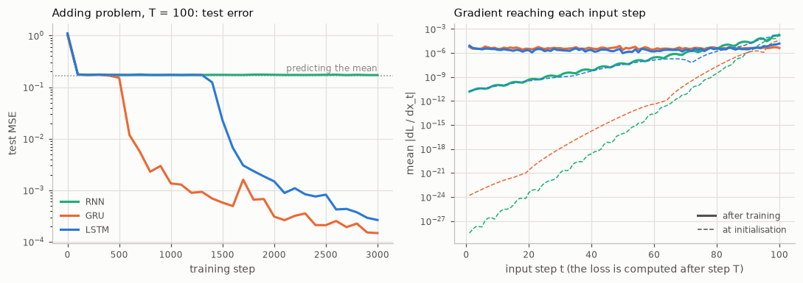
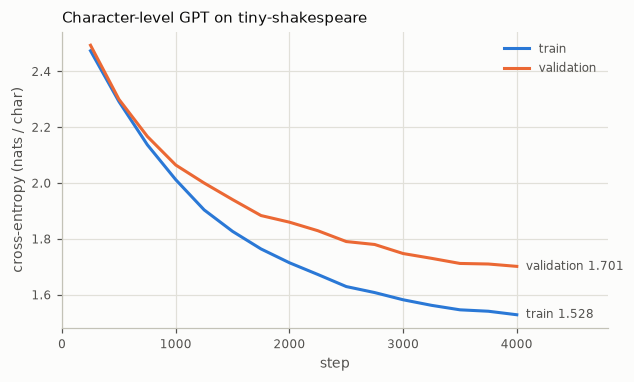

# tensorgrad

[](https://github.com/houssammehdi/tensorgrad/actions/workflows/ci.yml)
[](LICENSE)
[](pyproject.toml)

**tensorgrad** is a deep-learning framework written from scratch in Python and NumPy:
reverse-mode automatic differentiation to any order, JAX-style function transforms, and a
PyTorch-shaped `nn` / `optim` API whose outputs, gradients and Hessian-vector products match
PyTorch's to rounding error. It is small enough to read (about 6,700 lines of source, with
NumPy as the only dependency) and complete enough to train a character-level GPT, LSTMs and a
diffusion model on a CPU.

## Highlights

- **Derivatives of any order.** `loss.backward(create_graph=True)`, `tensorgrad.autograd.grad`
  and `tensorgrad.func` (`grad`, `vjp`, `jvp`, `jacobian`, `hessian`, `hvp`). Every op has a
  fast NumPy VJP for ordinary training and a differentiable one for double backward,
  convolutions, pooling, attention and recurrent layers included.
- **Verified derivatives.** Each op is checked against finite differences to first and
  second order on Hypothesis-drawn shapes, and 131 parity tests compare every op,
  module and optimiser with PyTorch in float64 ([docs/parity.md](docs/parity.md)).
- **Layers**: `Linear`, `Conv2d`, `MaxPool2d`, `BatchNorm1d/2d`, `LayerNorm`, `Embedding`,
  `Dropout`, `RNN` / `LSTM` / `GRU` (fused, with explicit backpropagation through time), fused
  multi-head attention, a pre-LN transformer block and a GPT with a KV cache.
- **Optimisers**: `SGD`, `Adam`, `AdamW`, parameter groups, gradient clipping, cosine and
  step schedules.
- **Tools**: a per-op profiler, graph drawing (Mermaid and Graphviz), gradient
  checkpointing, `gradcheck` and `gradgradcheck`, `.npz` checkpoints and SHA-256-pinned
  dataset downloads. Typed throughout (`mypy --strict`).

## Quickstart

```bash
git clone https://github.com/houssammehdi/tensorgrad.git && cd tensorgrad
python -m venv .venv && source .venv/bin/activate
pip install -e ".[dev,examples]"    # numpy; pytest, hypothesis, ruff, mypy; matplotlib
export OPENBLAS_NUM_THREADS=1         # see Limitations
pytest
```

Derivatives compose:

```python
import numpy as np
import tensorgrad as tg
from tensorgrad import func


def f(x):
    return (tg.tanh(x) ** 2).sum()


x = tg.Tensor(np.array([0.5, -1.0]))
t = np.tanh(x.data)
g = func.grad(f)(x)  # 2 tanh(x) (1 - tanh(x)^2)
H = func.hessian(f)(x)  # diagonal: 2 (1 - tanh^2)(1 - 3 tanh^2)
assert np.allclose(g.data, 2 * t * (1 - t**2))
assert np.allclose(np.diag(H.data), 2 * (1 - t**2) * (1 - 3 * t**2))

# The same through the engine: a gradient that can itself be differentiated.
w = tg.Tensor(np.array([1.0, 2.0]), requires_grad=True)
(gw,) = tg.autograd.grad((w**3).sum(), [w], create_graph=True)  # 3 w^2
(hw,) = tg.autograd.grad(gw.sum(), [w])  # 6 w
assert np.allclose(hw.data, [6.0, 12.0])
```

Training looks like PyTorch:

```python
from tensorgrad import nn, optim
from tensorgrad.datasets import make_spiral

tg.manual_seed(0)
xs, ys = make_spiral(n_per_class=100, n_classes=3, seed=0)
model = nn.Sequential(nn.Linear(2, 32), nn.ReLU(), nn.Linear(32, 3))
opt = optim.AdamW(model.parameters(), lr=1e-2, weight_decay=1e-4)

for step in range(100):
    loss = tg.cross_entropy(model(tg.Tensor(xs)), ys)
    opt.zero_grad()
    loss.backward()
    optim.clip_grad_norm_(model.parameters(), max_norm=1.0)
    opt.step()
```

tensorgrad can draw the graph it records. The diagram below is the output of this snippet
(`tests/test_readme.py` runs every Python block in this file and checks that the two agree):

```python
mlp = nn.MLP([2, 8, 3])
x, y = tg.randn((4, 2)), np.array([0, 2, 1, 2])
loss = tg.cross_entropy(mlp(x), y)
names = {"x": x, **dict(mlp.named_parameters())}
diagram = tg.viz.to_mermaid(loss, names=names, direction="LR")
```



## Examples and results

Unless a row says otherwise, each number comes from running the example with its default
settings, `OPENBLAS_NUM_THREADS=1 python examples/<name>.py --seed 0`, on a shared 4-vCPU
Linux VM. Timings are indicative.

| Example | What it shows | Result |
|---|---|---|
| [`spiral_mlp.py`](examples/spiral_mlp.py) | an MLP on a 2-D spiral | 99.5% test accuracy after 300 full-batch epochs (0.6 s) |
| [`shapes_cnn.py`](examples/shapes_cnn.py) | convolutions and `BatchNorm2d` on procedurally drawn shapes | 100.0% test accuracy after 6 epochs (13 s); 99.2 to 99.8% without batch norm (`--arch plain`, seeds 0 to 2) |
| [`char_gpt.py`](examples/char_gpt.py) | a GPT on tiny-shakespeare, sampled with a KV cache | validation loss 1.70 nats/char after 4,000 steps (24 min) |
| [`adding_problem.py`](examples/adding_problem.py) | RNN vs GRU vs LSTM over 100 steps (backpropagation through time) | test MSE: RNN 0.172 (predicting the mean: 0.167), GRU 0.0001, LSTM 0.0003 |
| [`ddpm_2d.py`](examples/ddpm_2d.py) | a denoising diffusion model on a 2-D swiss roll | energy distance to the data 0.0017 (second draw of real data: 0.0004, noise: 0.060) |
| [`newton_logreg.py`](examples/newton_logreg.py) | exact Hessians and Hessian-vector products | Newton reaches the optimum (to 1e-10) in 7 iterations and Newton-CG in 11; gradient descent is still 2e-5 away after 5,000 steps |
| [`maml_sinusoid.py`](examples/maml_sinusoid.py) | MAML: backpropagating through a gradient step | query MSE after one step on 10 points: 0.369 (MAML), 0.420 (first-order MAML), 2.281 (joint pretraining) |

**Diffusion.** The learned reverse process turns Gaussian noise into the spiral. Each point
is shaded by where it ends up, which shows how the noise is sorted along the curve.



**Long-range memory.** In the adding problem the target depends on two inputs up to 100
steps before the loss. The plain RNN never beats predicting the mean. The gated cells learn
to carry the gradient across the whole sequence (right: gradient reaching each step).



**Character-level GPT.** 4 layers, width 128, 4 heads, a 128-character context and 818,048
parameters, trained on the 1.1 MB tiny-shakespeare corpus, which is downloaded once and
checked against a pinned SHA-256:



```
step   500  train 2.292  val 2.300
step  2000  train 1.714  val 1.860
step  4000  train 1.528  val 1.701
trained 4000 steps in 1420.1s wall, 1313.8s CPU (355 ms/step wall, 328 CPU)
```

The start of an unedited 600-character sample (prompt `ROMEO:`, temperature 0.8):

```
ROMEO:
Shall on, take come a reply?

MENENIUS:
O shall are unkers and sir, farewill your lord;
And, without ever no that thou art, and bearful thy love,
And I am such is wish they cprown that behop.

BUCKINGHAM:
Staring them would the queen's convess to this words
To him is i' the wortorned, but if please. Say, hither,
The dreath, and we all of God many your behold:
```

Version 0.1.0 trained a 348k-parameter model on a 13 KB excerpt and overfit it: validation
loss 2.14 at best and 2.30 at the end, on a validation split of that excerpt. Most of the
improvement comes from the data. Trained on tiny-shakespeare, the old configuration
(`--steps 1200 --block-size 64 --batch-size 32 --n-layer 3 --n-embd 96 --lr 2e-3
--warmup 100`) reaches 1.96 on the validation split above, and the larger model, trained
for longer, 1.70. It has learned the format of a play (speaker names, verse lines,
punctuation) and many words, but not grammar or meaning.

The second-order examples have their own figures:
[Newton vs gradient descent](docs/newton_logreg.png) and [MAML](docs/maml_sinusoid.png).

## Performance

Training steps are 1.2 to 1.6 times faster than in version 0.1.0, and 1.5 to 1.6 times
with the allocator tuning that the examples apply (`utils.retain_freed_memory`). Against
PyTorch 2.14 on the same CPU with one thread each, the small MLP step takes 0.73 times
PyTorch's time (per-op overhead dominates, and NumPy's is lower), the GPT step 1.02 times
(both spend it in the same kind of matrix products) and the CNN step 2.0 times (PyTorch has
oneDNN's convolution kernels). Gradient checkpointing halves the GPT step's peak memory for
a third more time. The method, per-op profiles and the threading and allocator findings are
in [docs/performance.md](docs/performance.md).

## Documentation

- [docs/internals.md](docs/internals.md): the engine, the two VJPs per op, higher-order
  derivatives, function transforms, fused ops, memory and verification.
- [docs/performance.md](docs/performance.md): benchmarks, the comparison with PyTorch, and
  the threading and allocator findings.
- [docs/parity.md](docs/parity.md): what the PyTorch parity tests cover, and the deliberate
  differences.
- [CHANGELOG.md](CHANGELOG.md).

## Development

```bash
export OPENBLAS_NUM_THREADS=1
ruff check . && ruff format --check . && mypy --strict src
pytest                                 # what CI runs; tests that need torch skip themselves
pytest -m slow --run-slow              # longer training runs
pytest --hypothesis-profile=thorough   # 200 examples per property instead of 25
pytest tests/parity -m torch           # with PyTorch installed
```

## Limitations

- **CPU and NumPy speed.** Every op is a NumPy call plus Python overhead. There is no GPU
  support, no mixed precision and no kernel fusion beyond the fused ops.
- **BLAS threads.** These models do many small matrix products. On a shared machine,
  OpenBLAS's thread pool can make a step an order of magnitude slower, so the commands set
  `OPENBLAS_NUM_THREADS=1`, as CI does (see [docs/performance.md](docs/performance.md)).
- **No in-place tensor ops**, and so no version counters; optimisers write to `param.data`.
- **Scope.** Only 2-D convolution and pooling. Recurrent layers are unidirectional. The
  GPT's position embeddings are absolute, so the KV cache helps only up to `block_size`
  tokens. There is no optimiser `state_dict`. The global generator and the profiler assume
  one thread.
- `cross_entropy` takes the class axis **last** (`(..., C)` logits), unlike PyTorch; see
  the [parity notes](docs/parity.md) for this and the other deliberate differences.

## Project layout

```
src/tensorgrad/   tensor.py  autograd.py  func.py  ops/  nn/  optim/  utils/
                  datasets.py  profiler.py  viz.py
tests/            gradient checks, engine, higher order, values, nn, optim, examples,
                  README; parity/ (against PyTorch)
examples/         the scripts above; data/shakespeare.txt (see below)
benchmarks/       train_step.py  generate.py  vs_torch.py
docs/             internals, performance, parity, and the figures of the examples
```

`examples/data/shakespeare.txt` is a 13 KB excerpt of well-known speeches and sonnets,
typed in for this repository, so its wording may differ from standard editions. The tests
use it, and `char_gpt.py` falls back to it when it cannot download the real corpus.

## License

[MIT](LICENSE) © 2026 Houssam Mehdi
