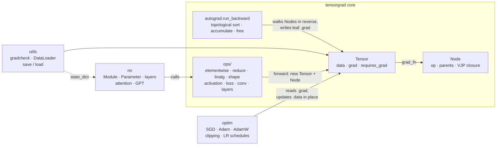
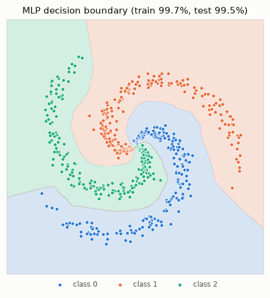
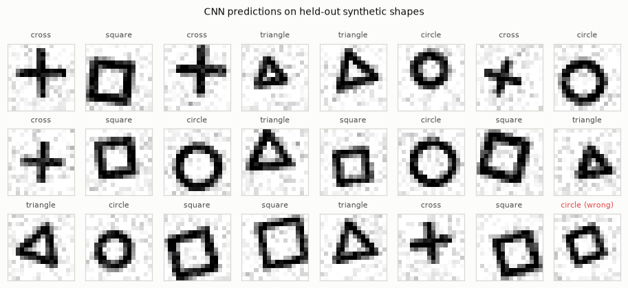

# tensorgrad

[](https://github.com/houssammehdi/tensorgrad/actions/workflows/ci.yml)
[](LICENSE)
[](pyproject.toml)

**tensorgrad** is a deep-learning framework written from scratch in Python and NumPy: a
reverse-mode automatic-differentiation engine over n-dimensional tensors, a PyTorch-shaped
`nn` / `optim` API on top of it, and worked examples that go all the way up to a GPT-style
transformer trained on Shakespeare in under four minutes on a CPU. All 43 differentiable ops
are checked against finite differences in float64, broadcasting patterns included
(property-based, with Hypothesis). It is small enough to read in an afternoon and complete
enough to train real models, which makes it a clear way to see what PyTorch does under the
hood.

## Features

- **Autograd core**: `Tensor(data, requires_grad)`, dynamic graphs, iterative topological
  sort, gradient accumulation, broadcasting-aware backward (sum-to-shape), `no_grad()` /
  `enable_grad()`, `detach`, `retain_grad`, `retain_graph`, graph freeing after backward,
  float32 by default and float64 for gradient checks.
- **Ops, all differentiable**: `+ - * / ** neg`, `matmul` (batched, broadcast, 1-D),
  `exp log sqrt tanh sigmoid relu gelu`, `sum mean max min var` over any axes with
  `keepdims`, `reshape transpose permute flatten squeeze unsqueeze`, NumPy indexing (basic,
  integer-array and boolean, with scatter-add backward), `concat stack where masked_fill`,
  stable `softmax log_softmax logsumexp`, `cross_entropy` from logits with `ignore_index`,
  `mse_loss`, `conv2d` (im2col, stride, padding), `max_pool2d`, `embedding`, `dropout`, fused
  `linear` and `layer_norm`, `batch_norm`.
- **nn**: `Module` with parameter/buffer registration, `named_parameters`, `state_dict` /
  `load_state_dict`, `train` / `eval`; `Linear`, `Conv2d`, `MaxPool2d`, `Embedding`,
  `LayerNorm`, `BatchNorm1d`, `Dropout`, activations, `Sequential`, `MLP`, causal
  `MultiHeadAttention`, pre-LN `TransformerBlock` and a `GPT` with weight tying and top-k
  sampling.
- **optim**: `SGD` (momentum, Nesterov, weight decay), `Adam`, `AdamW`, parameter groups,
  `clip_grad_norm_`, `CosineWarmupLR`, `StepLR`.
- **utils**: `gradcheck` (central differences on a random projection of the output),
  `DataLoader` over NumPy arrays, `save` / `load` via `np.savez` (no pickle).
- **Strictly typed** (`mypy --strict`); NumPy is the only runtime dependency.

## Quickstart

```bash
git clone https://github.com/houssammehdi/tensorgrad.git
cd tensorgrad
python -m venv .venv && source .venv/bin/activate
pip install -e ".[dev,examples]"      # numpy + pytest/hypothesis/ruff/mypy + matplotlib

export OPENBLAS_NUM_THREADS=1           # see "Limitations"
pytest                                  # full test suite
python examples/spiral_mlp.py           # well under a second of training
```

## Architecture



| Module | Responsibility |
|---|---|
| `tensorgrad/tensor.py` | `Tensor` (a NumPy array plus gradient bookkeeping), dtype defaults, factories |
| `tensorgrad/autograd.py` | `Node`, grad-mode switches, the backward engine |
| `tensorgrad/ops/` | Every differentiable op: forward in NumPy plus its vector-Jacobian product |
| `tensorgrad/nn/` | `Module` system, layers, attention, transformer, GPT |
| `tensorgrad/optim/` | Optimisers (typed per-parameter state), clipping, schedulers |
| `tensorgrad/utils/` | Gradient checking, mini-batching, checkpoints |
| `tensorgrad/datasets.py` | Spiral points, procedurally drawn shapes, a character tokenizer |

## How reverse-mode autodiff works here

Every op computes its output with NumPy and, if any input requires grad, attaches a `Node` to
the output: the input tensors plus a closure that maps the gradient of the output to the
gradient of each input (a vector-Jacobian product, VJP). Nothing else is recorded, so the
graph is exactly the computation that ran, Python control flow included.

`loss.backward()` then:

1. **Sorts** every tensor that `loss` depends on (and that requires grad) into topological
   order with an iterative DFS, so deep graphs do not hit Python's recursion limit.
2. **Seeds** d(loss)/d(loss) = 1 and walks the order in reverse. Each node receives the sum of
   the gradients flowing into it from all its consumers, calls its VJP and passes the results
   on to its parents.
3. **Accumulates** into `.grad` only at leaves (tensors you created, such as parameters),
   adding to what is already there. That is why optimisers call `zero_grad()`.
4. **Frees** each node's closure, and the activations it captured, once used, unless
   `retain_graph=True`. A second `backward()` through the same graph raises a clear error.

Worked example, `L = (x * y + x) ** 2` at `x = 2`, `y = 3`:

| Forward | Value | Backward (VJP) | Gradient |
|---|---|---|---|
| `a = x * y` | 6 | `dL/da = dL/db` | 16 |
| `b = a + x` | 8 | `dL/db = 2b` | 16 |
| `L = b ** 2` | 64 | seed | 1 |
| | | `dL/dx = dL/da * y + dL/db` (two paths, summed) | 16·3 + 16 = **64** |
| | | `dL/dy = dL/da * x` | 16·2 = **32** |

```python
import tensorgrad as tg

x = tg.tensor(2.0, requires_grad=True)
y = tg.tensor(3.0, requires_grad=True)
b = x * y + x
loss = b**2
print(loss.grad_fn, loss.grad_fn.parents[0].grad_fn)  # <Node pow> <Node add>
loss.backward()
assert (x.grad, y.grad) == (64.0, 32.0)
```

Broadcasting is the one subtle part. If `w` of shape `(1, 3)` is broadcast against `(4, 3)`,
its gradient has to be summed back over the stretched axis. Every binary op passes its input
gradients through `unbroadcast(grad, shape)`, which sums over prepended axes and over axes
that were size 1.

```python
import numpy as np

w = tg.Tensor(np.zeros((1, 3)), requires_grad=True)
(tg.Tensor(np.ones((4, 3))) * w).sum().backward()
assert w.grad.shape == (1, 3) and (w.grad == 4.0).all()
```

## API tour

Training looks like PyTorch:

```python
import tensorgrad as tg
import tensorgrad.nn.functional as F
from tensorgrad import nn, optim
from tensorgrad.datasets import make_spiral

tg.manual_seed(0)
xs, ys = make_spiral(n_per_class=100, n_classes=3, seed=0)

model = nn.Sequential(nn.Linear(2, 32), nn.ReLU(), nn.Linear(32, 3))
opt = optim.AdamW(model.parameters(), lr=1e-2, weight_decay=1e-4)
sched = optim.CosineWarmupLR(opt, warmup_steps=10, total_steps=100)

for step in range(100):
    loss = F.cross_entropy(model(tg.Tensor(xs)), ys)
    opt.zero_grad()
    loss.backward()
    optim.clip_grad_norm_(model.parameters(), max_norm=1.0)
    opt.step()
    sched.step()

with tg.no_grad():  # no graph is recorded: cheaper evaluation
    accuracy = (model(tg.Tensor(xs)).data.argmax(axis=1) == ys).mean()
```

Custom modules register whatever you assign to them, and checkpoints are plain `.npz` files:

```python
import os
import tempfile

from tensorgrad.utils import load, save


class Residual(nn.Module):
    def __init__(self, dim: int) -> None:
        super().__init__()
        self.norm = nn.LayerNorm(dim)
        self.ff = nn.MLP([dim, 4 * dim, dim], activation="gelu")

    def forward(self, x: tg.Tensor) -> tg.Tensor:
        return x + self.ff(self.norm(x))


block = Residual(8)
print([name for name, _ in block.named_parameters()][:3])
# ['norm.weight', 'norm.bias', 'ff.0.weight']

path = os.path.join(tempfile.mkdtemp(), "residual.npz")
save(block, path)
restored = Residual(8)
restored.load_state_dict(load(path))
```

Anything built from tensorgrad ops can be gradient-checked, whole modules included:

```python
from tensorgrad.utils import gradcheck

q = tg.Tensor(np.random.randn(2, 5, 4), requires_grad=True)  # float64
k = tg.Tensor(np.random.randn(2, 5, 4), requires_grad=True)
assert gradcheck(lambda q, k: F.scaled_dot_product_attention(q, k, k, causal=True), [q, k])
```

A GPT is a config away:

```python
gpt = nn.GPT(nn.GPTConfig(vocab_size=65, block_size=32, n_layer=2, n_head=2, n_embd=32))
logits = gpt(np.zeros((4, 32), dtype=np.int64))  # (batch, time, vocab)
tokens = gpt.generate(np.zeros((1, 1), dtype=np.int64), max_new_tokens=20, top_k=5)
```

The Python snippets in this README are executed by `tests/test_readme.py`.

## Examples and results

All numbers below come from running the commands shown, from the repository root, on a
4-vCPU Linux VM with `OPENBLAS_NUM_THREADS=1` (see [Limitations](#limitations) for why).
Each script is deterministic given `--seed`.

### 1. MLP on a 2-D spiral

```bash
OPENBLAS_NUM_THREADS=1 python examples/spiral_mlp.py --epochs 300 --seed 0
```

A `2 → 64 → 64 → 3` ReLU MLP (4,547 parameters), full-batch Adam, 600 training points:

```
epoch  100  loss 0.0283  train acc 0.995
epoch  300  loss 0.0113  train acc 0.997
train accuracy 0.997 | test accuracy 0.995 | 0.30s
```

<p align="center"></p>

### 2. CNN on procedurally generated shapes

```bash
OPENBLAS_NUM_THREADS=1 python examples/shapes_cnn.py --epochs 6 --seed 0
```

16×16 grayscale circles, squares, triangles and crosses are drawn in code with random
position, size, rotation, stroke width and pixel noise (4,000 train / 1,000 test images). The
network is `Conv(1→16) → ReLU → MaxPool → Conv(16→32) → ReLU → MaxPool → Linear(512→64) →
Dropout → Linear(64→4)`, 37,892 parameters, trained with Adam plus warm-up and cosine decay at
about 1 s per epoch:

```
epoch 1  loss 0.9458  train acc 0.561  test acc 0.869  (1.0s)
epoch 3  loss 0.0707  train acc 0.977  test acc 0.995  (3.1s)
epoch 6  loss 0.0192  train acc 0.996  test acc 0.999  (6.1s)

confusion matrix (rows = true, columns = predicted)
              circle    square  triangle     cross
    circle       250         0         0         0
    square         1       249         0         0
  triangle         0         0       250         0
     cross         0         0         0       250
```



The red tile is the one test image (out of 1,000) the model gets wrong: a small, rotated
square it reads as a circle.

### 3. Character-level GPT on Shakespeare

```bash
OPENBLAS_NUM_THREADS=1 python examples/char_gpt.py --steps 1200 --seed 0
```

The corpus, `examples/data/shakespeare.txt`, is 13,392 characters of well-known
public-domain speeches and sonnets (transcribed for this repo, so wording may differ
slightly from standard editions), split 90/10 into train and validation text. The model has
3 pre-LN blocks, 4 heads, width 96, a 64-character context and tied input/output embeddings
(347,712 parameters). It trains with AdamW (weight decay on matrices only, via parameter
groups), a cosine schedule with warm-up and gradient clipping, at 192 ms per step of 32×64
tokens: **1,200 steps in 3 min 50 s**.

```
step   100  train 2.451  val 2.449
step   600  train 1.673  val 2.140
step  1200  train 1.062  val 2.302
```


Sample from the final model (prompt `ROMEO:\n`, temperature 0.8), unedited:

```
ROMEO:
Our to this s scontrace oftuntrned forthe,
And nother death make thou ou weepus stay,
It is anttive this eat of this and grievor,
Friends the the coou hard-say is with take
And the heave to cambus
To fight the endo my to caion burse of fortuse,
For ther is and in the natrturys, the naperible of dor wish sinshall
Age froms the may of this I sought, seee of fars,
Agrie mellling neit to morre to sime un full of;
Dutlll the splall the of his wish hakes?
```

In under four minutes of CPU time the model has picked up the shape of verse (line lengths,
capitalised line starts, `,` and `;` at line ends), common words, and fragments of the corpus
("I sought", "full of", "of death"). The curves also show the limit of 12 KB of training
text: validation loss is lowest (2.14 nats/char) around step 600 and rises after that while
training loss keeps falling, so the model is memorising. More text, not more steps, is what
would help next.

## Design notes

- **Closures as VJPs.** Each op's backward is a closure over exactly what it needs: its
  inputs, or its own output where that is cheaper (`exp`, `tanh` and `sigmoid` reuse their
  outputs). Freeing a node drops the closure and the activations go with it, so memory holds
  one forward pass of activations instead of growing across steps. `no_grad()` skips node
  creation entirely; evaluation and `GPT.generate` use it.
- **Gradients are NumPy arrays**, not tensors. This keeps the engine and the optimisers
  simple and fast, at the cost of higher-order derivatives (see limitations).
- **Numerical stability.** `softmax`, `log_softmax` and `logsumexp` subtract the row max
  before `exp`, with a guard for rows that are entirely `-inf` (as in masked attention).
  `cross_entropy` works from logits with log-sum-exp and uses the fused gradient
  `softmax(z) - one_hot(y)`; it never evaluates `log(softmax(z))`, which underflows to `-inf`.
  `sigmoid` evaluates `exp(-|x|)` so neither branch can overflow. Gradient checks run in
  float64; training runs in float32.
- **Fused ops where the graph would be wasteful.** `linear` is one node instead of three
  (transpose, matmul, add), and `layer_norm` has a hand-derived backward,
  `rstd · (ĝ − mean(ĝ) − x̂ · mean(ĝ·x̂))`, instead of about ten primitive nodes. Both are
  gradchecked like everything else. `batch_norm` and `mse_loss` are composed from primitives,
  which shows that composition works too.
- **im2col convolution.** `conv2d` uses `sliding_window_view` to expose every receptive
  field as a strided view, copies it once into an `(N·OH·OW, C·KH·KW)` patch matrix and does
  a single BLAS matmul. The backward pass is two matmuls plus a col2im scatter that loops only
  over the `KH·KW` kernel offsets. The cost is memory: the patch matrix is about `KH·KW` times
  the size of the input. That is fine at these scales, but it is why production libraries use
  implicit-GEMM or Winograd kernels instead.
- **Scatter-add wherever indexing can repeat.** Advanced indexing and `embedding` use
  `np.add.at` in their backward pass, so rows selected more than once receive every
  contribution. Weight tying works the same way: the GPT head and the token embedding are one
  `Parameter` used twice, and the engine sums both gradients.
- **Attention masks are verified through gradients.** The causal-mask test backpropagates
  from position *t* and asserts that the input gradient at every position after *t* is exactly
  zero, which is a stronger check than comparing outputs.
- **Typed optimiser state.** `Optimizer[StateT]` is generic over a per-parameter state
  dataclass (`_AdamState(exp_avg, exp_avg_sq, step)`), so `mypy --strict` checks the update
  rules. Schedulers rescale each parameter group's `initial_lr`.

## Testing

```bash
export OPENBLAS_NUM_THREADS=1
pytest                           # fast suite
pytest -m slow --run-slow        # longer training runs
ruff check . && ruff format --check . && mypy --strict src
```

- `tests/test_gradcheck_ops.py`: finite-difference checks for every op. Hypothesis draws the
  shapes, including mutually broadcastable shape pairs, reduction axes and permutations.
- `tests/test_autograd.py`: engine semantics, including accumulation, diamond graphs, graph
  freeing (checked with weak references), `retain_graph`, `no_grad`, `detach` and a
  5,000-node chain.
- `tests/test_ops_values.py`: forward values against naive loops (convolution, pooling) and
  stability under extreme logits.
- `tests/test_nn.py`: module registration, `state_dict` round trips, BatchNorm running
  statistics, causal masking via gradients, attention against a hand-written reference,
  whole-module gradchecks of an MLP and a transformer block, GPT weight tying.
- `tests/test_optim.py`: SGD, Adam and AdamW against hand-unrolled update rules, plus
  clipping, schedules and parameter groups.
- `tests/test_training.py` and `tests/test_examples.py`: end-to-end training (the spiral MLP
  must pass 90% training accuracy within 200 steps) and smoke runs of every example script.

CI runs the same commands on Python 3.11 and 3.12.

## Limitations

- **CPU only, at NumPy speed.** Every op is a NumPy call plus Python overhead, with no kernel
  fusion or graph compilation. A framework such as PyTorch, which runs fused C++ kernels
  without per-op Python overhead, should be many times faster on the same CPU (not
  benchmarked here). tensorgrad is for learning and small experiments, not for performance.
- **BLAS threads.** These models do many small matrix products, where OpenBLAS's thread pool
  can cost more than it saves. On the VM used above, default threading made the spiral
  training about 50× slower, so the commands set `OPENBLAS_NUM_THREADS=1`, as CI does.
- **First-order only.** Gradients are plain arrays, so there is no double backward (no
  Hessian-vector products, no gradient penalties).
- **No in-place ops on tensors**, and therefore no version counters. Optimisers write to
  `param.data` directly.
- **Scope.** Only 2-D convolution and pooling, no KV cache in `GPT.generate` (each sampled
  token re-runs the context window), no mixed precision, no optimiser `state_dict`. The global
  generator and grad mode are not designed for multi-threaded training.
- `cross_entropy` takes the class axis **last** (`(…, C)` logits), which suits sequence
  models; PyTorch puts it second.

## Project layout

```
src/tensorgrad/      tensor.py · autograd.py · ops/ · nn/ · optim/ · utils/ · datasets.py
tests/               gradchecks, engine, values, nn, optim, training, examples, README
examples/            spiral_mlp.py · shapes_cnn.py · char_gpt.py · data/shakespeare.txt
docs/                figures generated by the examples
```

## License

[MIT](LICENSE) © 2026 Houssam Mehdi
